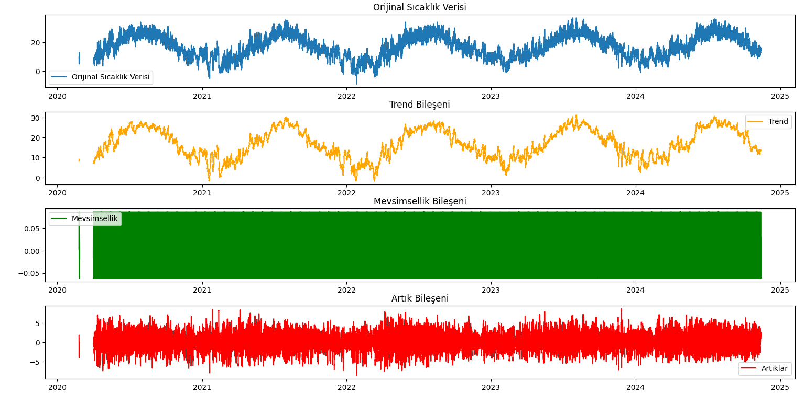
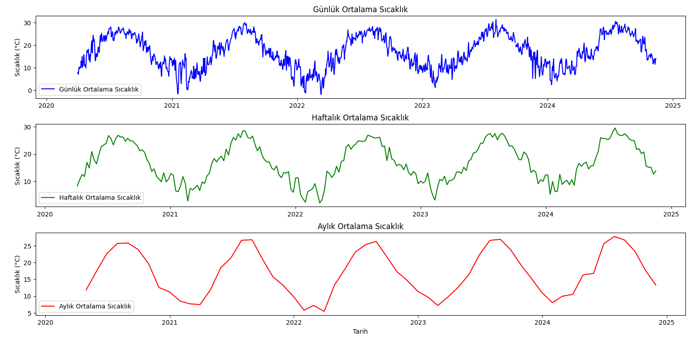

# Hava Durumu Verisi İşleme ve Analizi

Bu proje, hava durumu verilerinin toplanmasını, temizlenmesini ve analiz edilmesini otomatikleştirmektedir. **Selenium** kullanarak web üzerinden veri toplar ve **Pandas** ile veriyi işler. Projenin amacı, saatlik hava durumu verilerini toplamak, eksik verileri doldurmak ve eğilim, mevsimsellik ile ortalamaları analiz etmektir.

## Özellikler
- **Web Kazıma**: Belirtilen bir web sitesinden saatlik hava durumu verilerini toplar.
- **Veri Temizleme**: Eksik değerleri doldurur ve verileri kullanılabilir formatlara dönüştürür.
- **Veri Analizi**:
  - Sıcaklık verilerini eğilim, mevsimsellik ve artık bileşenlerine ayırır.
  - Günlük, haftalık ve aylık ortalamaları hesaplar.
  - Veri içgörüleri için görselleştirmeler oluşturur.

## Gereksinimler
Aşağıdaki araç ve kütüphanelerin sisteminizde kurulu olduğundan emin olun:
- Python 3.8+
- Google Chrome tarayıcı
- ChromeDriver
- Python kütüphaneleri (`requirements.txt` dosyasında listelenmiştir)

## Kurulum

1. **Depoyu Klonlayın**:
   ```bash
   git clone https://github.com/HilalYuce/weather-data-analysis.git
   cd weather-data-analysis
   ```

2. **Bağımlılıkları Yükleyin**:
   ```bash
   pip install -r requirements.txt
   ```

3. **ChromeDriver İndirin** (eğer `webdriver_manager` kullanmıyorsanız):
   - Chrome tarayıcınıza uygun sürümü [buradan](https://chromedriver.chromium.org/downloads) indirin.
   - PATH'e ekleyin veya `Service` yapılandırmasını güncelleyin.

## Kullanım

### 1. Web Kazıma
Hava durumu verilerini toplamak için aşağıdaki komutu çalıştırın:
```bash
python weather_scraper.py
```
- Veriler bir Excel dosyasına kaydedilecektir (örneğin, `weather_data_YYYYMMDD_HHMMSS.xlsx`).
- Loglar `weather_data_log.txt` dosyasına kaydedilir.

### 2. Veri Temizleme ve İnterpolasyon
Toplanan verileri işlemek ve eksik verileri doldurmak için:
```bash
python data_cleaning.py
```
- Eksik veriler temizlenir ve doldurulur.
- Çıktı `ana_veri_interpolasyon.csv` dosyasına kaydedilir.

### 3. Veri Analizi
Temizlenmiş verileri analiz etmek ve görselleştirmeler oluşturmak için:
```bash
python data_analysis.py
```
- Veriler bileşenlerine ayrıştırılır (eğilim, mevsimsellik, artıklar).
- Günlük, haftalık ve aylık sıcaklık ortalamaları hesaplanır ve görselleştirilir.

## Proje Dosyaları
- `weather_scraper.py`: Selenium ile hava durumu verilerini otomatik olarak toplar.
- `data_cleaning.py`: Eksik ve bozuk verileri işler, CSV dosyasına kaydeder.
- `data_analysis.py`: Sıcaklık verilerini ayrıştırır ve ortalamaları hesaplar.
- `requirements.txt`: Python bağımlılıklarını listeler.

## Örnek Görselleştirmeler
### Eğilim, Mevsimsellik ve Artık Analizi


### Günlük, Haftalık ve Aylık Sıcaklık Ortalamaları


## Loglama
- Tüm işlemler ve hatalar `weather_data_log.txt` dosyasına kaydedilir.
